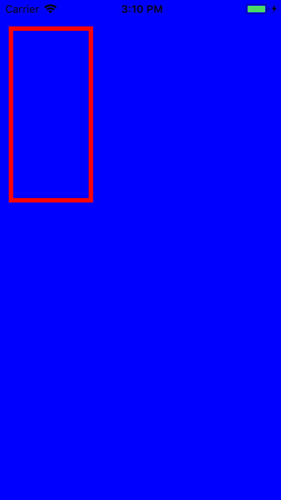
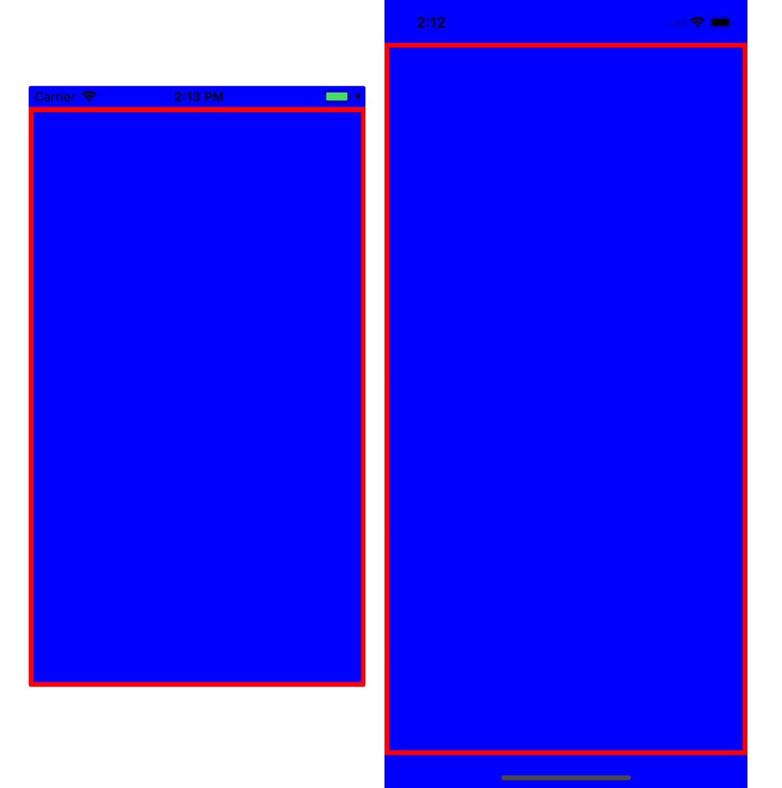

# Pinner

[](https://travis-ci.org/DenisLitvin/Pinner)
[](http://cocoapods.org/pods/Pinner)
[](http://cocoapods.org/pods/Pinner)
[](http://cocoapods.org/pods/Pinner)

## Usage

If you you want to see the full example, run the example project, clone the repo, and run `pod install` from the Example directory first.

### Pinner
All constraints are specified as the input parameters. Call the method of `UIView` - `makeConstraints(for:)` which takes one or more instances of `CSMConstraintType` enumeration, separated with commas.
```swift
enum CSMConstraintType {
    case top
    case leading
    case left
    case bottom
    case trailing
    case right

    case height
    case width

    case centerX
    case centerY
}
```

All calculations are made in the closure. You can easily pin the view to any side of it's superview with `pin(to:)`, method of the instance of `CSMConstraintPinner`, or `pinAndReturn(to:)` if you want to use the constraint later.
Constants are made by using `equal(_:)` or `equalAndReturn(_:)` methods.

#### Input parameters for `pin` methods (use in that order):
- `_ anchor` : NSLayoutAnchor - anchor point.
-  `const` : CGFloat - constant offset in certain axis.
- `mult` : CGFLoat - multiplier, uses only for height and width anchors.
- `options` : CSMConstraintOptions - possible options: `.equal`,  `.lessOrEqual`, `.moreOrEqual`.

**By default you only need to specify the anchor, all constraints are activated and underlying view has it's property `translatesAutoresizingMaskIntoConstraints` set to false!**

#### Input parameter for `equal` methods is only the constant(CGFloat).

You also have an ability to return all anchors within a closure by using `returnAll()` method on `CSMConstraintPinner`.
And you can deactivate your constraints using `deactivate(_ :)` with the index of constraint, or use `deactivateAll()`.

<p align="center">

</p>

### Example
```swift
someView.makeConstraints(for: .top, .left, .width, .height) { (make) in
    self.someViewTopAnchor = make.pinAndReturn(to: self.view.topAnchor, const: 30)
    make.pin(to: self.view.leftAnchor, const: 10)
    make.pin(to: self.view.widthAnchor, mult: 0.3)
    make.equal(200)
}
```
### Helper functions

1. Arrange view based on `Safe Area Layout Guide` that works for all devices and ios versions:
<p align="center">

</p>

```swift
viewController.fillSafeArea(with: someView)
```

2. If you want to cover the entire superview:
```swift
someView.fillSuperview()
```

3. Anchor to center of a view:
```swift
someView.anchorCenterSuperview()
```
or
```swift
someView.anchorCenterXToSuperview(constant: 10)
someView.anchorCenterYToSuperview(constant: 5)
```
## Installation

**CocoaPods:**

Add the line `pod "Pinner"` to your `Podfile`

**Manual:**

Clone the repo and drag the file `Pinner.swift` into your Xcode project.

## Platform support

- iOS 9.3 and above

## Author

DenisLitvin, den.litvinn@gmail.com

## License

Pinner is available under the MIT license. See the LICENSE file for more info.
